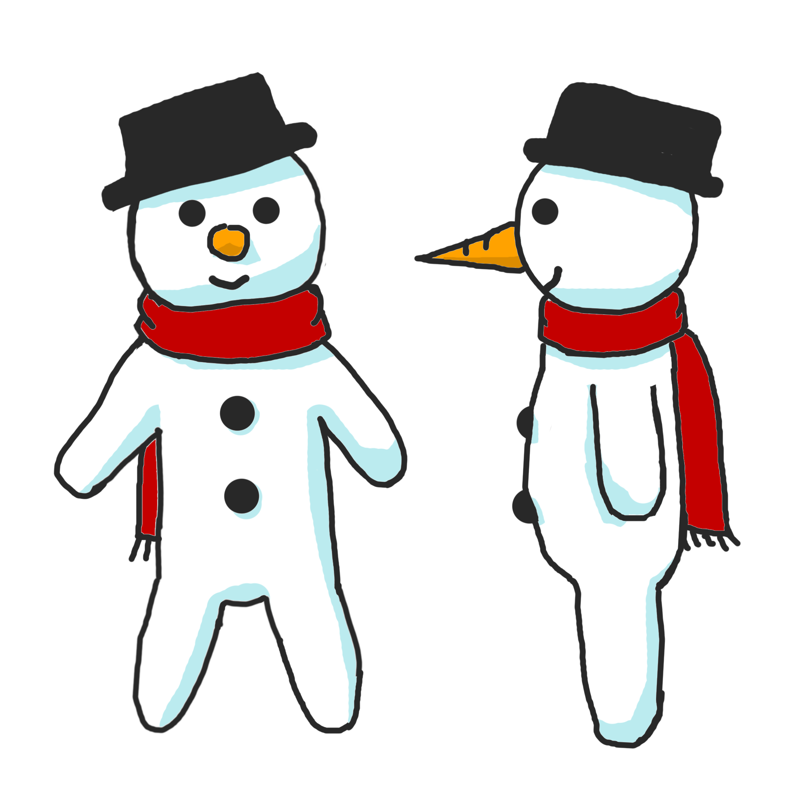

# Tutorial Toon

### 1. Concept Art
- [Etapa de pré-produção](../fluxo-de-trabalho/etapa1-pre-producao)  
  

### 2. Modeling
- Basics:
    - New file: camera, light and cube
    - Select (Left Mouse Button)
    - Rotate (Middle Mouse Button)
    - Zoom (Girar roda do Midle Mouse Button)
    - Drag (shift + click Middle Mouse Button)
- Movimentação rápida
    - Select Object
    - Opção de Teclas:
        - G
            - GZ
            - GX
            - GY
            - G shift Z
            - G shift X
            - G shift Y
        - Alt G
        - R
            - RZ
            - RX
            - RY
            - R shift Z
            - R shift X
            - R shift Y
        - Alt R
        - S
            - SZ
            - SX
            - SY
            - S shift Z
            - S shift X
            - S shift Y
        - Alt S
    - Mover mouse, movendo objeto.
    - Left Mouse Button aceita nova posição
    - Right Mouse Button devolve objeto para posição inicial
- Edit Mode vs Object Mode
- Crtl D para undo
- Crtl shift D para redo
- Inclusão de imagens de background
    - Selecionar câmera
    - Abrir Painel de Propriedades, menu Object Data Properties
    - Ativar Background Image e adicionar imagem na câmera.
- Configurar apresentação de background na câmera
    - Na visualização de layout
    - Use 2 telas de 3D View
    - Em uma das telas, selecione a Câmera e ative a aba de transformação com a tecla N.
    - Na outra 3D view, use o techa Numpad 0 para ver a view da câmera selecionada.
- Alterar entre Orthographic e Perspective View Mode
    - Numpad 5
- Alterar entre Views
    - CAMERA >> 0
    - TOP >> 7
    - BOTTOM >> 9
    - FRONT >> 1
    - BACK >> crtl 1
    - RIGHT >> 3
    - LEFT >> crtl 3
    - Mover view para esquerda >> 4
    - Mover view para direita >> 6
    - Mover view para cima >> 8
    - Mover view para baixo >> 2
    - Ajuste Tranformações na câmera para poder modelar a partir da imagem.
    - Modele na view 3D onde a câmera foi seleciona inicialmente.
    - Fazer o mesmo para todas as views necessárias, com posição de câmera também diferentes.
        - Se preferir, use mais de 1 câmera.
- Selecione o cubo e o prepare para modelagem:
    - Janela Properties
    - Aba Modifiers
    - Add Modifier
    - Add Subdivision Surface
- Na janela 3D View, com cubo selecionado:
    - Menu Object
    - Shade Smooth
- Selecionar tudo >> a
- Deselecionar tudo >> alt a
- Selecionar com box e arrasto >> b LMB Arrasto
- Selecionar com círculo >> c
- Wireframe mode >> z
### 3. Rigging

### 4. Shading

### 5. Animation

### 6. Rendering

